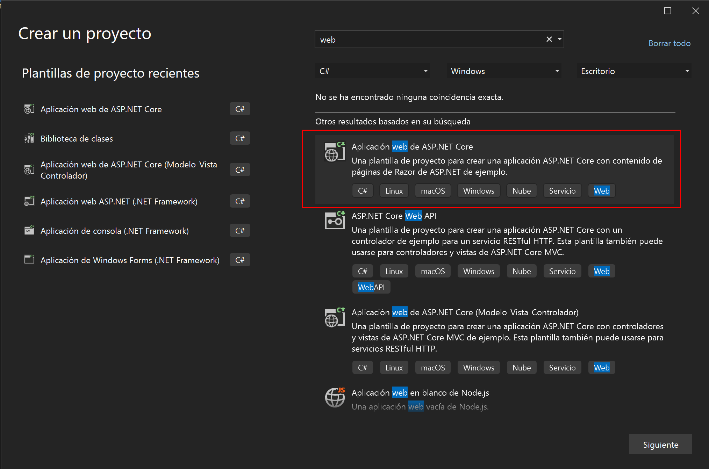
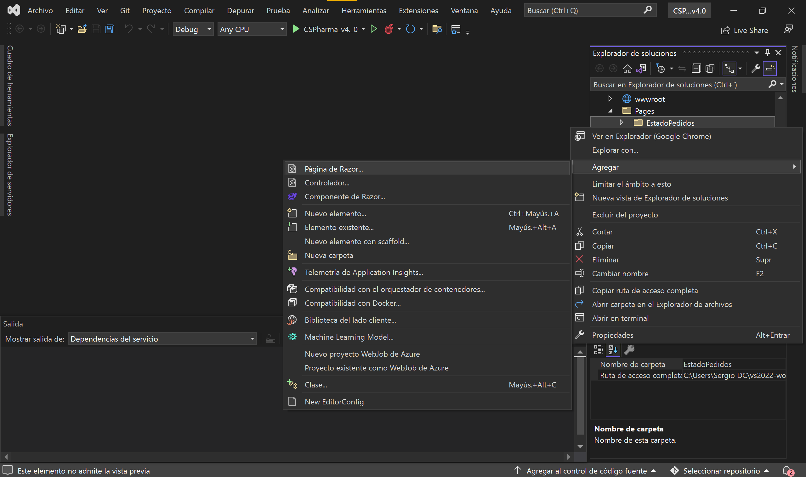
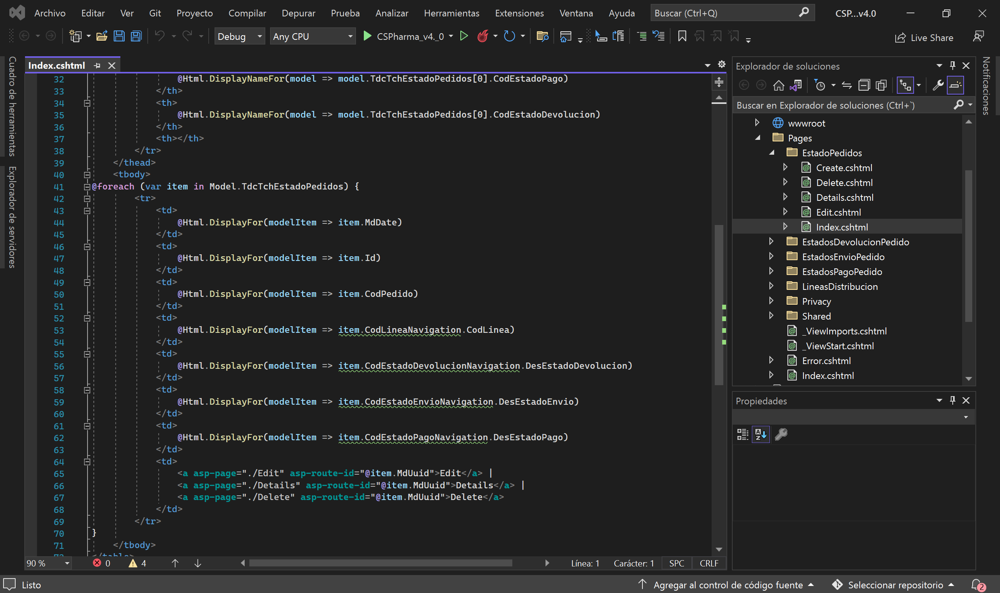
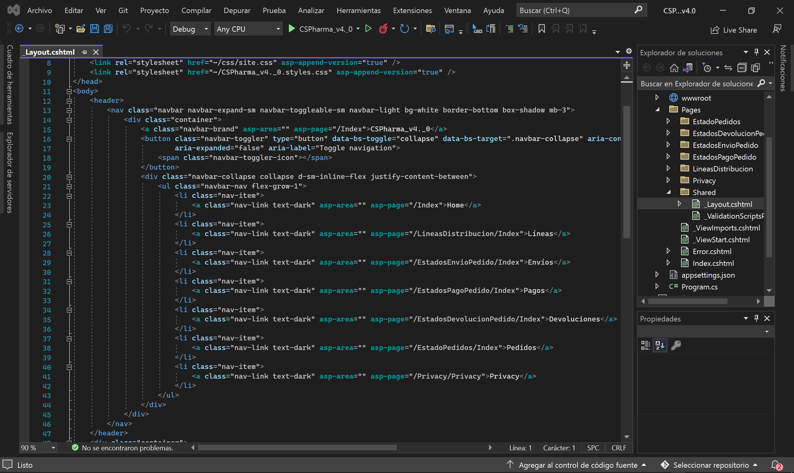
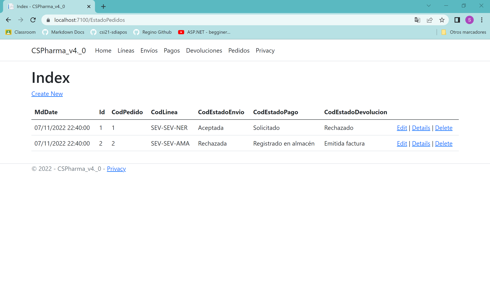
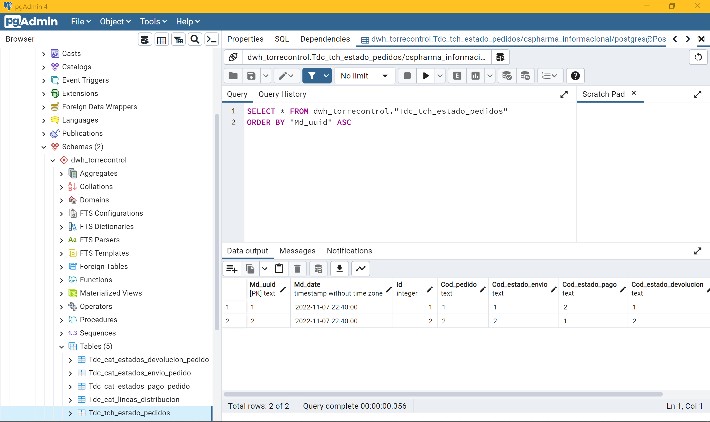

# CSPharma-v4.1

## Introducción

Esta versión es igual que la v4.0, pero desarrollado en un tipo de proyecto de Aplicaión Web ASP.NET Core con vistas Razor.

Cuando creamos el proyecto, nos damos cuenta de que ya no tenemos la estructura de MVC predefinida, si no que en su lugar, tenemos un directorio principal para los controladores y sus vistas. Este directorio se llama "Pages" y actúa como DocumentRoot.

El desarrollo de esta versión es exactamente igual que la anterior, pero cambiando la forma en que añadimos los controladores con las vistas de los CRUDs automáticos.

Para enrutar los distintos CRUDs, tenemos que volver al *_Layout.cshtml* y definir en la ruta la carpeta donde se encuentra el controlador y sus vistas, y el Index de cada una de ellas. 

La ejecución del programa es igual que en la versión v4.0.

